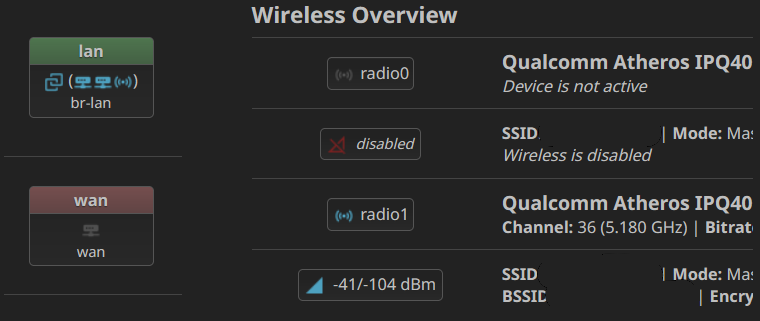

## openwrt-icon-minimal
Icon set for OpenWRT to provide a better indicator.
original icon in openwrt is too pain. hard to indicate which one on or off. switch, bridge, ethernet icon look too similar. that why i create new icon set.

All icon was from https://pictogrammers.com/library/mdi/

under licence https://pictogrammers.com/docs/general/license/ (Apache 2.0)

### Sample Picture

* tested on Bootstrap default in OpenWRT 24.x .
* sample picture use `Noto Sans` font. not default font from OpenWRT.

### Discussion Forum
https://forum.openwrt.org/t/minimal-icon-set-png-svg-for-openwrt-please-improve-it-dev

----------------------
### favicon-mod
* For better favicon. optimize color for dark theme.
